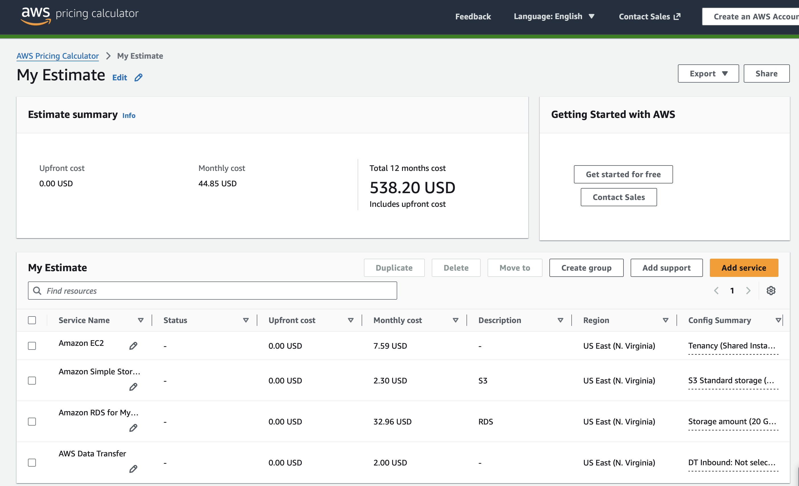

# Exploring AWS Services Lab - Solution

**Student Name:** Maryam Ahmadi  
**Date Completed:** 04.02.2026

---

## Exercise 1: Console Navigation

### Part A: Service Discovery

**EC2 (Compute):**
- Purpose: EC2 is used to run virtual servers (instances) in the cloud, providing scalable compute capacity.
- Screenshot: 

**S3 (Storage):**
- Purpose: S3 is used for object storage, storing files such as backups, media, and static website content.
- Screenshot: 

**RDS (Database):**
- Purpose: RDS is used to run managed relational databases (e.g., MySQL, PostgreSQL) without handling underlying infrastructure.
- Screenshot: 

**VPC (Networking):**
- Purpose: VPC is used to create isolated virtual networks, controlling network access and routing for AWS resources.
- Screenshot: 

**IAM (Security):**
- Purpose: IAM is used to manage users, roles, and permissions, securing access to AWS resources.
- Screenshot: 

### Part B: Console Features

**Lambda Category:**   Which category? Compute  

**Pinned Services:**


**Recently Visited:**


**Region Selector:**

- Original region: us-east-1
- Changed to: us-west-2
- Changed back: Yes

---

## Exercise 2: Service Categorization

### Completed Service Matrix:

| Category | Services | Primary Use Case |
|----------|----------|-----------------|
| Compute | EC2, Lambda, Elastic Beanstalk | Running applications and serverless functions |
| Storage | S3, EBS, EFS, Glacier | Storing and managing data |
| Database | RDS, DynamoDB, ElastiCache | Relational, NoSQL, and in-memory databases |
| Networking | VPC, CloudFront, Route 53 | Connecting resources, CDN, DNS |
| Security | IAM, KMS, CloudTrail | Access control, encryption, audit logging |
| Management | CloudWatch, CloudFormation, Systems Manager | Monitoring, automation, and resource management |
 

### Research Question Answers:

**1. What's the difference between EC2 and Lambda?**

- EC2 provides virtual servers you manage, suitable for applications needing persistent compute.  
- Lambda is serverless, running code only when triggered, no server management required.

---

**2. When would you use S3 vs EBS?**

- S3 → Object storage for files, backups, static content.  
- EBS → Block storage attached to EC2 instances for OS and application data.
---

**3. What's the difference between RDS and DynamoDB?**

- RDS → Managed relational SQL databases.  
- DynamoDB → NoSQL key-value/document database, serverless, highly scalable.

---

**4. Why do you need a VPC?**

- To create isolated networks, control routing and security, and manage private/public subnets.

---

**5. What does CloudWatch monitor?**

- Metrics like CPU, memory, disk, network usage, logs, and application performance.

---

## Exercise 3: AWS CLI

### CLI Version:
```
aws-cli/2.33.12 Python/3.13.11 Darwin/25.2.0 source/arm64
```

### Configuration:
```
NAME       : VALUE                    : TYPE             : LOCATION
profile    : <not set>                : None             : None
access_key : ****************FHEX     : shared-credentials-file : 
secret_key : ****************Ib0a     : shared-credentials-file : 
region     : us-east-1                : config-file      : ~/.aws/config
```

### CLI Outputs:

See attached `cli-outputs.txt` file for all command outputs.

**Key findings:**
- My AWS Account ID: "202145728564",
- Default region: us-east-1
- Number of regions available: 22+ 


**Additional CLI commands explored:**  
- `aws ec2 describe-instances` → List all EC2 instances in current region  
- `aws iam list-users` → List IAM users  
- `aws ec2 describe-security-groups` → List security groups and VPCs  
- `aws cloudwatch list-metrics --namespace AWS/EC2` → View metrics available for EC2  


---

## Exercise 4: Pricing Research

### Pricing Worksheet:

**1. EC2 t3.micro (Linux, us-east-1):**
- On-Demand: $0.0104 per hour  
- Monthly (730 hours): $7.59  
- Free Tier eligible: Yes  
- Free Tier details: 750 hours/month free for first 12 months

**2. S3 Standard Storage:**
- 100 GB monthly cost: $2.30  
- Free Tier: First 5 GB free  
- Cost per GB: ~$0.023/GB

**3. RDS db.t3.micro (MySQL):**
- Monthly cost: $15.00  
- Storage (20 GB): ~$2.40  
- Total: ~$17.40  
- Free Tier eligible: Yes

**4. Data Transfer OUT:**
- 100 GB cost: $9.00  
- First 1 GB free per month

### AWS Pricing Calculator Estimate:



**Estimate Link:** https://calculator.aws/#/estimate
**Total Estimated Monthly Cost:** $44.85

---

## Exercise 5: Documentation Hunt

### EC2 Instance Types:
- Documentation URL: https://docs.aws.amazon.com/AWSEC2/latest/UserGuide/instance-types.html  
- t3.medium vCPUs: 2  
- t3.medium memory: 4 GiB

### S3 Storage Classes:
- Documentation URL: https://aws.amazon.com/s3/storage-classes/  
- All storage classes:  
  1. Standard  
  2. Intelligent-Tiering  
  3. Standard-IA  
  4. One Zone-IA  
  5. Glacier Instant Retrieval  
  6. Glacier Flexible Retrieval  
  7. Glacier Deep Archive  
- Cheapest for archive: Glacier Deep Archive

### IAM Best Practices:
- Documentation URL: https://docs.aws.amazon.com/IAM/latest/UserGuide/best-practices.html  
- Three best practices:  
  1. Use least privilege  
  2. Enable MFA  
  3. Rotate credentials regularly


### Free Tier Limits:
- Documentation URL: https://aws.amazon.com/free/  
- EC2 t2.micro hours/month: 750 hours  
- S3 storage free: 5 GB
---

## Exercise 6: Regions and Availability Zones

### Your Current Region:
- Region Name: US East (N. Virginia)  
- Region Code: us-east-1  
- Number of AZs: 6
### Concept Questions:

**What is the difference between a Region and an Availability Zone?**  
- A Region is a geographic area with multiple data centers.  
- An Availability Zone (AZ) is an isolated data center within a region.

---

**Why does AWS have multiple regions?**  
- To reduce latency, meet compliance requirements, and provide redundancy.

---

**How many Availability Zones does each region typically have?**  
- Typically 2–6 AZs per region.

---

**Can you deploy resources in multiple regions simultaneously?**  
- Yes, but resources in different regions operate independently.

---


### Region Selection Analysis:

| Scenario | Best Region | Reasoning |
|----------|-------------|-----------|
| Serving users primarily in Europe | eu-west-1 (Ireland) | Closest region for lowest latency |
| Lowest cost for non-critical workloads | us-east-1 | Historically lower pricing |
| GDPR compliance required | eu-central-1 (Frankfurt) | Compliant with EU GDPR regulations |
| Serving users in Asia-Pacific | ap-southeast-1 (Singapore) | Nearest region to users in Asia |
| Need newest AWS services | us-east-1 | Often first region to get new services |


---

## Bonus Challenges

### Challenge 1: Cost Estimate

**Architecture:**
- 1x t3.medium EC2 (24/7)
- 1x db.t3.micro RDS (24/7)
- 50 GB S3
- 100 GB data transfer

**Estimated Monthly Cost:** $ 

**Calculator Link:** [URL]

---

### Challenge 2: Service Comparison

| AWS | Azure | GCP |
|-----|-------|-----|
| EC2 | [Azure service] | [GCP service] |
| S3 | [Azure service] | [GCP service] |
| RDS | [Azure service] | [GCP service] |
| Lambda | [Azure service] | [GCP service] |

---

### Challenge 3: CLI Advanced

[Paste outputs of advanced commands here]

---

## Reflection

**What surprised you most about AWS services?**  
- How many services exist and how detailed their pricing and management options are.

---

**Which AWS service are you most excited to learn about?**  
- Lambda and serverless architecture, because it eliminates server management.

---

**How comfortable do you feel navigating the AWS Console now?**  
- 9/10 – After this lab, I can efficiently find services, use search, and manage regions.

---

## Checklist

- [x] All service dashboards visited and documented  
- [x] All CLI commands executed successfully  
- [x] All pricing research completed  
- [x] All documentation URLs found  
- [x] Region analysis completed  
- [x] All screenshots captured  
- [x] All questions answered  
- [x] Work committed to Git  
- [x] Pull request created

---

**Completed By:** Maryam Ahmadi  
**Date:** 04.02.2026
